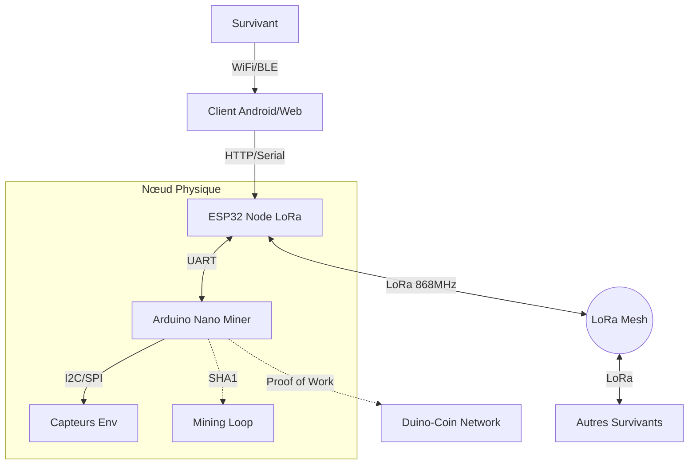

# 🏗️ Architecture du Système Escargot

```mermaid
graph TD
    User[Survivant] -->|WiFi/BLE| App[Client Android/Web]
    App -->|HTTP/Serial| ESP32[ESP32 Node LoRa]
    
    subgraph "Nœud Physique"
        ESP32 <-->|UART| Arduino[Arduino Nano Miner]
        Arduino -->|I2C/SPI| Sensors[Capteurs Env]
        Arduino -.->|SHA1| DUCO_Mining[Mining Loop]
    end
    
    ESP32 <-->|LoRa 868MHz| Mesh((LoRa Mesh))
    Mesh <-->|LoRa| OtherNodes[Autres Survivants]
    Arduino -.->|Proof of Work| DUCO[Duino-Coin Network]
```